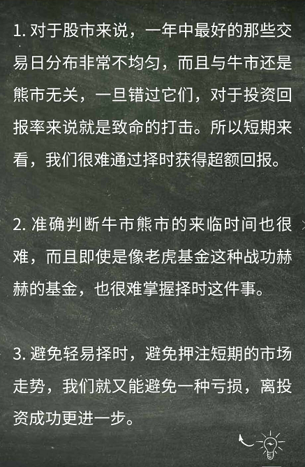
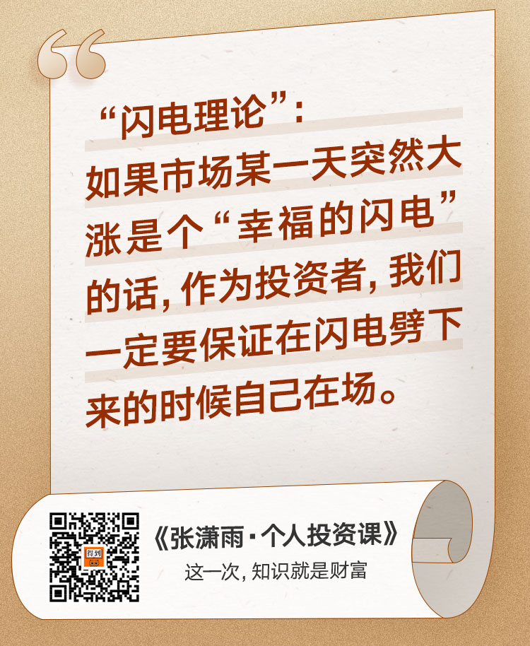
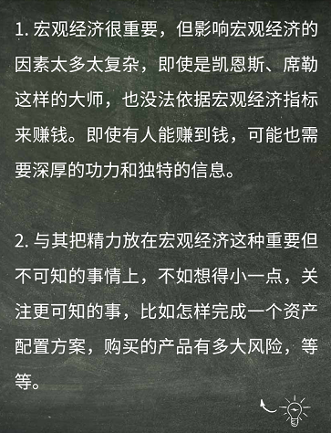
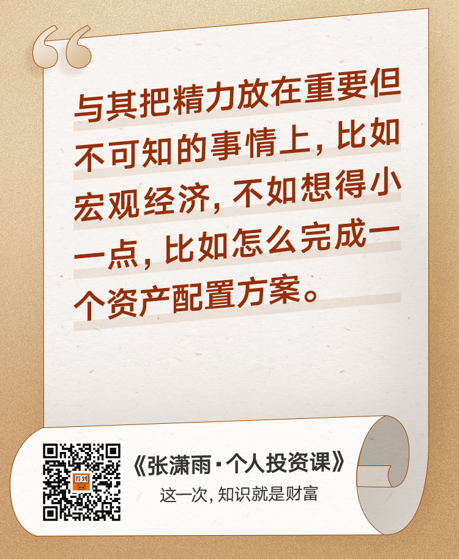
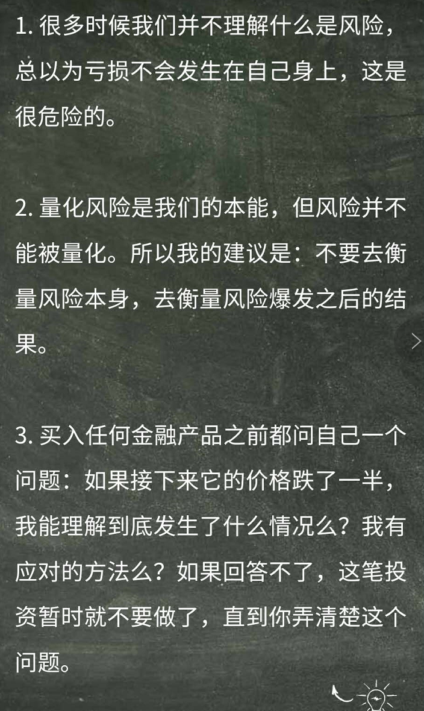
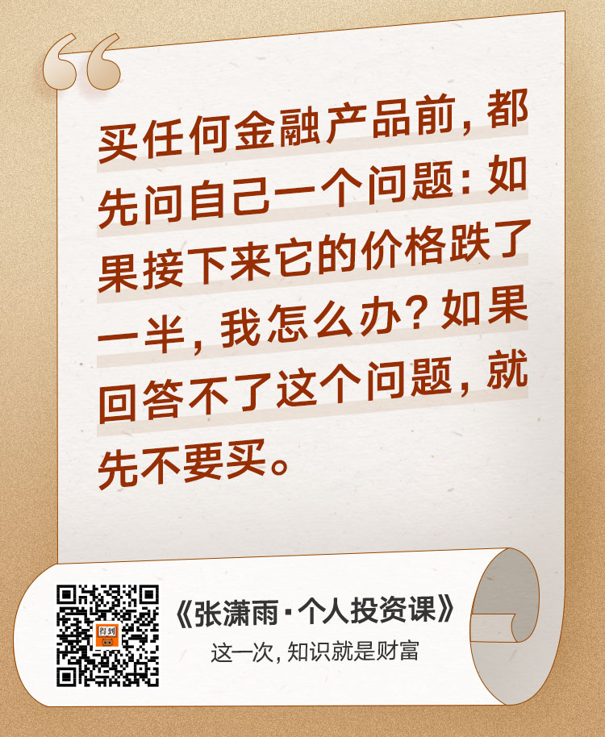

-----------------------------------------------------------------

得到App

## 导论

知识就是财富，普通投资者不用被别人左右，而专业投资者拥有更优越的资源。

## 市场规律

### 1.多元分散

### 2.不要择时

不要认为自己能看准接下来会上涨还是下跌。这太幼稚了。

一般上涨也就那么几天，逃过了下跌，也逃过了上涨。

举例了一些著名的投资人，他们也不可能算的那么正好。

#### 课后思考：自己有没有择时的例子呢，失败了还是成功了

没有择时的例子，但是自己脑子中有种思维模型，就是看时机这种思维方式。现实是这个时机我是看不准的。

### 3.关于宏观经济

同样的，宏观经济很重要，但是不是我的菜，我更应该做的也就是这些：

1.自己的投资期限的长短

2.如何针对性的配置自己的资产

3.购买国内外基金的时候，哪家的费用和成本低

4.如果我有外币，我该如何管理，才能提高点收益

#### 课后思考：我觉得宏观经济形式和投资策略有什么关系？我在投资中会受相关消息的影响吗？

我认为的宏观经济形式指的是一些世界发展趋势。比如5G，无人驾驶，人工智能等。这可以看做一些热门的范围，板块吧。

我也不知道我应不应该受相关消息的影响。但是我觉得我投资应该有自己的规则可寻。而不是听到什么消息后影响了自己的决策。并且，自己所能接触到的消息，应该没什么价值，都是些人云亦云，道听途说。

### 4.面对风险

不要去想风险的概念，多考虑风险的结果

风险咱也琢磨不定。总会有黑天鹅发生~这本书我也该看看了

#### 课后思考：上次投资账面亏损较大的时候是什么情况？在之前我有什么风险考量？亏损较大的时候我有什么应对方式吗？

上次亏损较大的时候应该是2017年底，自己瞎买股票的事，亏了10%。那时候啥也不懂。之前也没有什么风险的考量。就是觉得好玩，体验一下。亏盈都无所谓，但是当看到自己的钱在减少的时候，是很恐惧的。

现在，来说，如果面对较大亏损的时候，我考量补仓，或者本身就一直在定投。