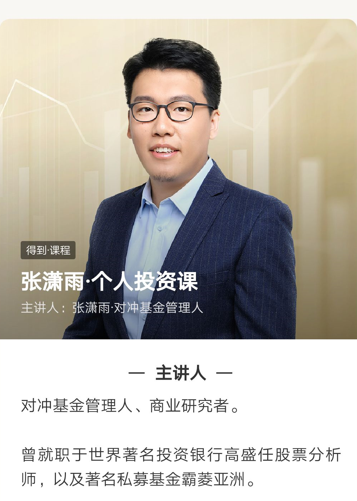
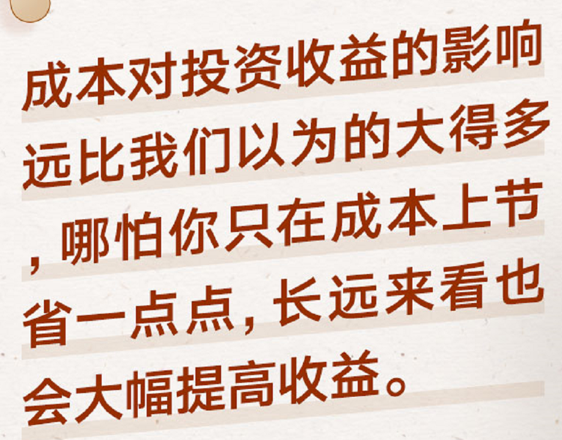
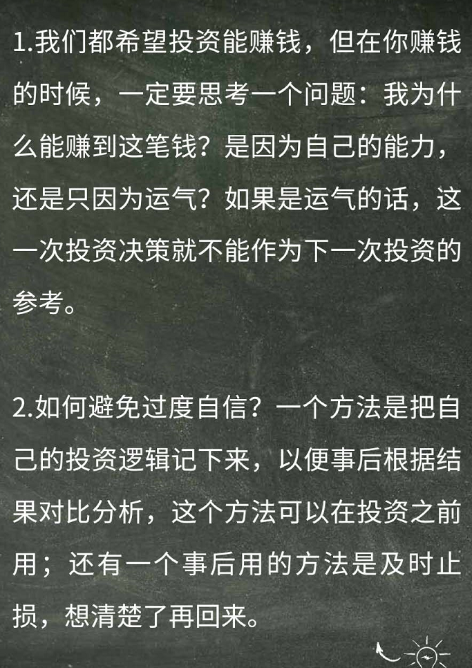
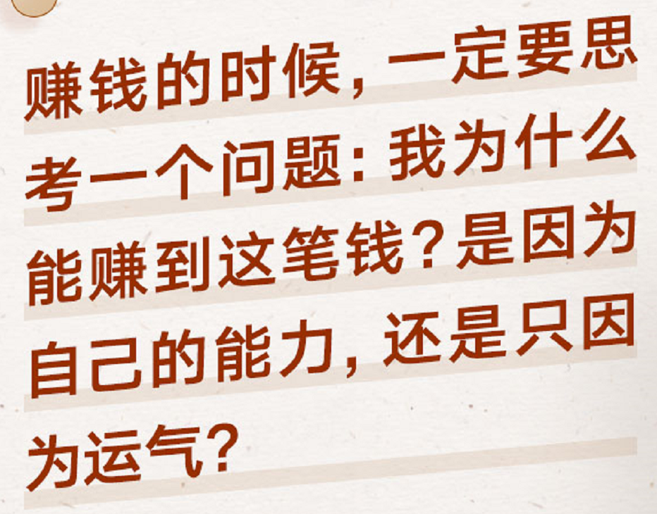
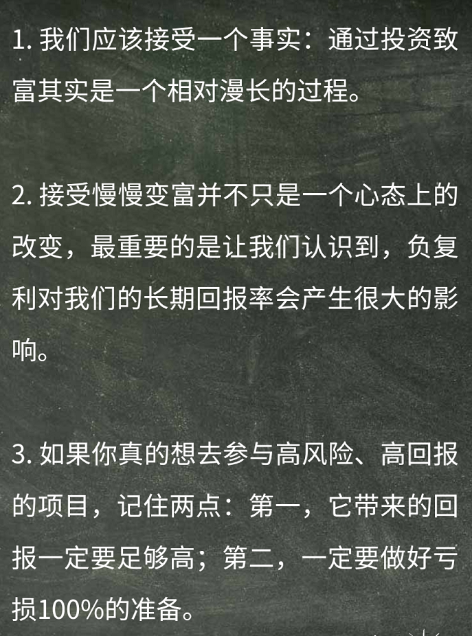
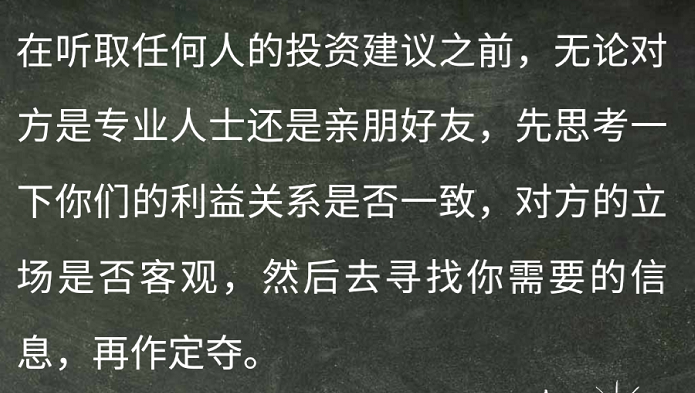
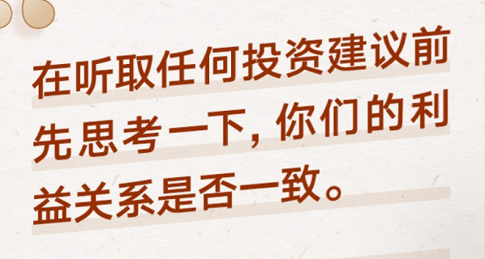
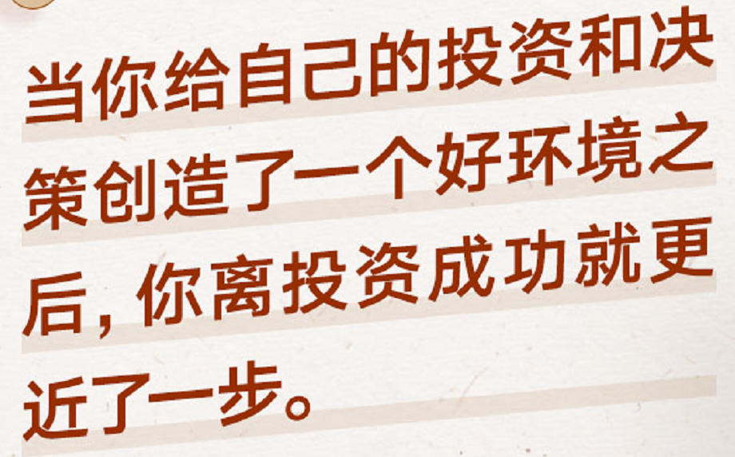
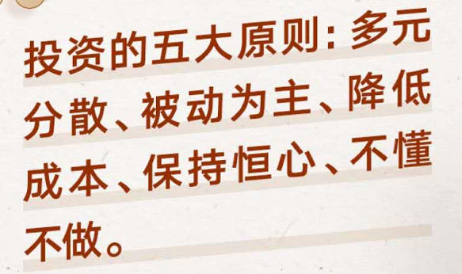

-----------------------------------------------------------------

得到App

## 导论

知识就是财富，普通投资者不用被别人左右，而专业投资者拥有更优越的资源。

## 市场规律

### 1.多元分散

个人的成长经历，是对投资有影响的。应该更理性，跳出个人生长经历，不要因为某类产品以前给自己留下了不好的印象，就断然否决。要不然显得很幼稚。

**尽量忘掉投资偏好，多元配置投资组合**

不错过某个大涨的品类，同时也符合反脆弱的道理。综合配置。

#### 思考题：我有没有投资偏好呢？这种偏好来源是哪里，这种偏好有没有合理或者不合理的地方？

我并没有什么投资偏好。但是如果说对一些理财产品的看法，倒是有点。

像原油，黄金，自己内心里不觉得这是自己的菜，自己也不懂这些东西。还有期货，觉得就像是在赌博。但是对于股票，基金，自己起码碰过。

其实还是自己的了解不够。想原油黄金，都是被动地听说过，从来没有积极的求证过。所以这些东西给我留下的印象完全取决的当时我遇到了什么人，说了什么话。所以这是很不靠谱的。很不合理的。

### 2.不要择时

不要认为自己能看准接下来会上涨还是下跌。这太幼稚了。

一般上涨也就那么几天，逃过了下跌，也逃过了上涨。

举例了一些著名的投资人，他们也不可能算的那么正好。

#### 课后思考：自己有没有择时的例子呢，失败了还是成功了

没有择时的例子，但是自己脑子中有种思维模型，就是看时机这种思维方式。现实是这个时机我是看不准的。

### 3.关于宏观经济

同样的，宏观经济很重要，但是不是我的菜，我更应该做的也就是这些：

1.自己的投资期限的长短

2.如何针对性的配置自己的资产

3.购买国内外基金的时候，哪家的费用和成本低

4.如果我有外币，我该如何管理，才能提高点收益

#### 课后思考：我觉得宏观经济形式和投资策略有什么关系？我在投资中会受相关消息的影响吗？

我认为的宏观经济形式指的是一些世界发展趋势。比如5G，无人驾驶，人工智能等。这可以看做一些热门的范围，板块吧。

我也不知道我应不应该受相关消息的影响。但是我觉得我投资应该有自己的规则可寻。而不是听到什么消息后影响了自己的决策。并且，自己所能接触到的消息，应该没什么价值，都是些人云亦云，道听途说。

### 4.面对风险

不要去想风险的概念，多考虑风险的结果

风险咱也琢磨不定。总会有黑天鹅发生~这本书我也该看看了

#### 课后思考：上次投资账面亏损较大的时候是什么情况？在之前我有什么风险考量？亏损较大的时候我有什么应对方式吗？

上次亏损较大的时候应该是2017年底，自己瞎买股票的事，亏了10%。那时候啥也不懂。之前也没有什么风险的考量。就是觉得好玩，体验一下。亏盈都无所谓，但是当看到自己的钱在减少的时候，是很恐惧的。

现在，来说，如果面对较大亏损的时候，我考量补仓，或者本身就一直在定投。

### 5.海外配置

资产的增长和这个国家的发展速度，没有必然关系

本土偏好，是的，也很局限。一个国家的经济只占全球经济的一小部分。市场不可预测，品类不可预测，地域不可预测，那就更综合的配置资产。不要因为我们生在中国，就只买中国相关的产品。想一想，这不同样是很局限的想法嘛。

#### 思考题：你有过海外资产配置的经历嘛？除了中国，我还关注那些国家？

目前还没有海外资产配置的经历，我连中国市场也没怎么关注过呀，以后多多关注。

### 6.该何时买出一只股票

想成功，就尽量多的避开错误

#### 很明显的不该买出的理由

要知道什么时候买出，那么有没有什么很明显的不该买出的时候呀

仅仅因为下跌了，就该卖吗？

仅仅因为上涨了，就该卖吗？

#### 真正的买出理由

发现了这笔钱的更好的去处。

就是买入理由不成立了。

### 本章总结

本章讲市场的规律，让我们认识市场。

打破了一些成见。投资产品是有很多种的，我们不要根据自身成长经历，就默认的认为某种产品好于不好。还有，我没买卖的时候，就会有个默认的思考模型，要选择合适的时机操作，但是一般我们没有这个能力。还有宏观经济，一般认为，就要看个中政策，看发展趋势，同样我们依旧没有靠宏观形势开指导投资的能力。

对于风险。我们也量化不出来风险。我们只能囫囵的接受或不能接受这样的后果。

对于海外配置资产属于多元分散的范围。地域上的多元分散。

总的来说，承认我们很无力。我们是那么的平庸。我们的确是一个门外汉。我们不能预知未来，我们也不可知一些机密，得知的尽是些道听途说报道。我们就只能打破各种成见。多个品类，多个地域，综合配置资产，能够得到稳步的一丁丁的收益就很满足了。

## 投资工具

### 1.指数基金：买到伟大公司的最好的机会

作为一名个人投资者，用过个股赚钱是非常难的。

上市公司中，好公司的概率是很小的。大部分上市公司还是很烂的。

投资的时候远离个股，分散性的投资指数，才是更理性的选择。

#### 思考题：我有没有购买个股失败或成功的经历？回头看，失败或成功的主要原因是什么呢？

反正是有失败的经历的，主要原因就是瞎买呀。更具筹码理论，感觉还是符合课程中的情况，就买了一手。其实就是瞎买。

### 2.安全边际：好公司不等于好股票

再好的公司，如果你不管价格就买入，也可能是亏钱的。更何况，什么才叫好公司呢？盈利好，看到的报道都是正面的，就能说明这个是好公司了嘛？好公司，股票就会上涨嘛？

但是像一些科技巨头，还可以算的上好公司吧。

价格的高低一般是不好评判的。但是一些很明显的情况，还是可以判断的。比如，小米公司大概值450亿到500亿，但是突然有一天市场下跌，小米的市值到了300亿，那么这就很明显了。如果有一天突然小米市值被搞到800亿了。这也有点浮夸了。

另外，想判断出450亿500亿，这对一般人来说也是很难的。所以，还是不要搞个股。

#### 思考题：我在买股票的时候一般是怎么给公司估值的呀？定性判断还是定量判断在我的投资体系了更重要一些呢？

我在买股票的时候，没有给公司估值过，以前没哟，以后也不会有了，我不要再自己挑股票了。

以前买股票看的筹码，算是定性，并没有具体的量。就是瞎买。所以以后不要自己买股票！

### 3.抄底哲学：市场的不理性与买入时机

什么时候是底呀？你以为自己给股价评个价值，觉得低了就是底了嘛？

不要接飞刀--不要幻想自己有抄底的能力

作为价值投资者，我们都相信价格虽然会和价值偏离，但最终都会回归。但问题是，没人知道这种回归什么时候发生！！！

接市场的飞刀，要比接个股的飞刀，容易的多。

#### 思考题：你在投资的时候有没有捡便宜的倾向？对于抄底，你有什么心得或者教训嘛？

有点这种倾向吧，就像前段时间，新冠肺炎开始在美国爆发，美国的科技股下跌，当时就觉得下跌了，赶紧买入吧。这就是一种捡便宜的心里。

自己只是这么想过，但是没有实际操作过。并没有什么经验。

### 4.主动管理：不要盲信专业光环

聪明投资者，很少会买这些主动型基金

更理性的方式是投资被动复制市场的基金。

去信任某个主动型基金的基金经理，其实也就是让他替自己的搞个股。他的专业能力能填补我对市场的无知嘛？显然，他也是个人，他不是神，也不能预知未来。他对宏观经济也把控不到位。

所以还是被动地去跟着市场。去买那些复制市场的的基金。就是无作为，市场怎样，自己就怎样。

#### 思考题：我有没有比较信任的基金经理呢？我是如何判断他们的水平的呢？他们的业绩如何呢？

答案是没有。我所卖的那个基金，也是瞎买的。

### 5.交易成本：快速提高真实收益的最佳方法

收费的问题，会占很大一部分。

这个费用的问题，具体的技术一定要搞明白！

#### 思考问题：我在投资中注意成本么？有什么经验嘛？

没有注意成本，自己买的支付宝中的基金，费用好像是0.15%，然后是买一次就要付出这些费用嘛？我也不太清楚，我要搞清楚这个。

我在支付宝上买的大成优选混合

买入费率：0.15%

管理费：1.25%每年

托管费：0.25%每年

买出费：0.5%

### 6.最重要的投资心法

诚实！就是老老实实的承认自己真的无能为力。认为掌握了那些简单的理论，就能赚到钱？认为看了两个的筹码理论就无敌额？这都是侥幸。

市场是很公平的，有多少认知能力就赚多少钱。

### 本章总结

同样，还是在说，你不要买个股，你没那个能力，没那个水平。这种个股赚钱的难度，太大了。如果非要买，需要考虑好安全边际的问题。还有对于抄底的讨论。

那买什么呢？也不是提倡买吧，只是说，指数基金，被动型指数基金，也许更适合你。要注意几个问题，买指数基金，而不是主动基金，主动基金，就相当于委托更专业的人士去买个股。被动地基金，跟着市场走。要知道大部分人，是跑不赢大盘的。对于买基金，考虑一下成本的问题，尽量买成本低的基金。

## 自我局限

### 1.过度自信：投资赚到钱一定是好事吗？

多少明星交易员都因为一次失败而一败涂地。

偶然赚到了钱，却认为是自己的能力所赚的，那么下次就会亏回去。就像泽亮说的那个同事。

方法：投资前，投资前把自己的投资逻辑记录下来。投资后，及时止损。

#### 思考题：我有没有因为运气甚至错误的判断反而赚到了钱呢？

买那个时时彩，追大小龙，只要一次失败，全盘皆输。本来那就是个N次不相干的独立重复试验。因为侥幸心理的作用。

### 2.反向复利：你能接受“慢慢变富”嘛？

巴菲特99.8%的财富都是50岁以后获得的

马云也是。

就是哪个指数函数曲线，前半部分是很漫长的。这是事实。慢慢变富，除了需要时间，当然还需要本金。

首先，我们只能慢慢变富。慢慢变富的基本原理是复利效应。要成功需要两个条件，更长的时间，更多的本金。然后慢慢的，一年收益个10%，年复一年，稳定这个收益。然后每年再他这一年的场外收入投入进去。

那么阻碍我们慢慢变富的事情有什么呢？

首先是亏损，假如今年你盈利100%，那么下一年只需要亏损50%就把你打回了原形。所以面对10%是盈利与10%的亏损的时候。亏损更害人。还有一点就是人的心态。如果你经常搞动不动收益就是百分之好几百的时候，回头再来看年收益8%，就没有兴趣了。但是事实是，我们能走线富有的唯一道路就是慢慢的积累，慢慢的变富。

对于高风险高回报的产品的两点购买建议：

第一：这个产品的回报一定要足够高。潜在收益一定是上百倍才行。

第二：做好100%亏损的准备。

因为只能是这样了，这种高回报的产品，那一定要够高才行，同样愿赌服输，就当这个钱本身就没有了就行了。

#### 思考题：你觉得资产达到什么水平就是相对‘富有’了呢？你觉得这个达到这个目标合理的时间是多长？

一千万人民币能算富有嘛，在上海一套房子就是这个价钱了。。。。

十年达到不算过分吧

### 3.利益错位：如何对待别人的投资建议

股票分析师的评级是人家的工作，人家级是评这个的。他这个评级和我们买入卖出他能怎么能挂钩呢。行业分析师是要拿到公司客户的钱的，肯定要给人家评个好的级别呀。

还有一些理财顾问，他们的赚钱方式是提取卖给你的理财产品的提成，所以他们更会卖给你能给他们带来更高提成的产品，但是我们能不能赚钱，那他就不管了，只要卖给你了，他就有钱拿。

#### 思考题：你最常获取投资建议的来源是什么呢？你觉得这个这个来源的有点和问题这那儿？

没有其他的建议来源。有些朋友说什么股票赚钱了等等都是说说而已。我也知道他们也不懂。

### 4.场外因素：决定成败的非技术因素

第一：维护独立做决策的能力

第二：提高场外赚钱的能力  越不需要搞投资赚钱的人，越有可能靠投资赚钱

#### 思考题：影响自己投资状态的最大的场外因素是什么？为什么？你是如何管理他们的呢？

我觉得影响自己最大的场外因素，应该就是自己的老婆，老婆这个角色，好像天生就是要来管钱的。但是如果她又不懂一些基本投资常识，这就非常糟糕了。

我觉得最好就是和自己的老婆一块学习投资知识，也许她不同意自己的这笔投资，也让她尽量能理解做投资，就会有时候不会被被人理解这件事情。

### 5.五大原则：投资很简单，但并不容易

比起依靠自己的自律能力，远离诱惑本身要重要得多。

真的就是什么都不做~这个是最反人性的！

再说一遍：多元分散，被动为主，降低成本，保持恒心，不懂不做。

#### 思考题：课程学到这里，你对那条原则的体会最深，自己的投资行为有哪些相应的改变？

被动为主挺颠覆的。就是去买那些被动的复制指数的基金。因为人算不如天算呀！被动，一定要被动。做投资最忌讳的积搞来搞去，一折腾，要来回教买入卖出手续费，还会错过一些上涨的关键时刻。所以就是巴菲特的那种，当没什么可做的时候，就不要瞎JB搞。要学着做一只乌龟

趴着就不动，一动不动。并且还活的时间长。不要做兔子，上蹿下跳，折腾来折腾去。又提高了成本，还没有恒心，还啥都想搞一搞。这是大忌！

### 6.问答：我学了一个金融学理论，可以用来做投资嘛？

很明显，是不可以的。知道一个理论的东西，就要用来知道实际的操作，这很明显不可能。想落地，没那么简单。

如果自己做策略这里给了几个简单的概括步骤：提出假设，验证假设，参数优化，样本外检查，实盘交易。

对于加密货币，可以适当配置，仅此而已。咱又不是李笑来，不懂呀。

