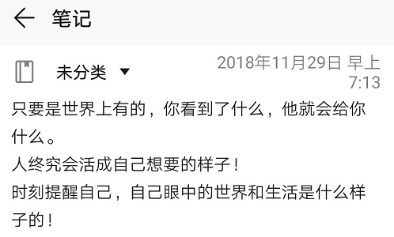

--------------------------------------

知乎读书

### 第一章 你究竟想要什么

主要讲金钱的重要性，这个毋庸置疑啦，金钱太他吗重要了，我一天天不就为了那几百块钱吗

##### 五个方面：

健康  财务  关系  情感  人生意义

##### 一个思考

我的兴趣是什么，我究竟如何通过这个兴趣来赚钱

##### 一个价值观

要创造赚钱机器，不要终其一生的做一个赚钱机器

##### 四个方面

梦想   价值观  目标   策略

### 第二章 责任

我是要对我的未来负责的。回想一下，我能有今天的这个情况，还不都是因为我自己的决定。就像文中说的那样，拿起一个棍子的一头，另一头也会跟着起来。今天的一些决定就会影响明天的自己。就是这么简单明了，就是个棍子！

给自己谋划一个美好的未来吧！

有的是事情是需要我们负责的，有的却不需要我们负责。要我对某一件的负责，同时我也就有权利改造某一件事。承担更多的责任，扩大自己的执行范围，将更多的关于自己的事情，掌握在自己手中，这难道不是把控自己命运的一种方式吗？

是的，我是要对自己的生活负责的！慎重点吧！再想想，我还要对我的父母负责，对我的未婚妻负责，将来还有娃娃....

责任重大！好好经营！！！

### 第三章 100万是难以企及的奇迹吗？

##### 改变的五个层次：

1，不满现状。对现状感到不满，要开始行动，要改变。这是2018年夏天的时候，我不满足于只在那个小城市呆子，不不满于当时的工作，我自己学习。然后来到了上海工作。

2，技巧。只是一味的按照自己的认知去操作，效果实在是太差。这时我需要学习，领略更多的技巧。我2019年春天已经开始在这方面有所思考了，自己买了一些书，一些资料，去学习更多关于学习效率，关于睡眠，关于理财的技巧。

3，成为人物。就是要将你之前学到的技巧，熟练熟练再熟练，达到炉火纯青的地步，然后成为一个领域的人物。

4，世界观。对世界的看法，尝试着反思一下自己的世界观，他真的是以前自己认为的那样嘛？也许这个世界有其他的运作方式。

5，人生观。对自己的认知，也许自己也不是自己认为的那样。反思吧。我是把自己看做是一个程序员呢，我还是把自己看做解决某一个问题的专家。

##### 两个小提示

1.赶紧找个快速阅读的书看看，学习一些阅读技巧，马上从第二个层次改变

2.遇到有趣的人，让他推荐两三本书，听听他的评价。这样会很有收获。

##### 关于日记

成功日记本：记录下自己获得的每一次夸奖，每一次认可，或者给人带来了快乐的事情。

思想日记本：记录自己的创意

关系日记本：记录所有使自己快乐的关系

知识日记本：记录自己从犯过的错中学到的东西，使自己不会重蹈覆辙

其他日记本：记录一些其他的事情

##### 讲座

这个作者说他一年至少参加四次讲座，并且能在参加后的两个月内，通过额外收入能挣回来参加讲座的钱。

##### 一句很有意思的话

和狗一起睡觉的人，注定是和跳蚤一起长大的

##### 总结

做出改变，进入陌生的环境。我需要有勇气开始，在这个过程中我需要好的运气。好运气是通过反复的练习获得的。

作出改变的技巧，改变自己的信念。自己的生活，自己的意识形态是一个系统，需要理解它，然后从深层次的信念开始改变。

### 第四章 为什么没有更多人变得富有

##### 给财富定个明确的定义吧

首先，来写下来两个数字：在多少年内，获得多少钱：五年，一百万。

做个图册，几面都是描述自己已经达到了那种目标的场景。将他真实化。

其实，这我18年来上海前，我就深深的体会到了这种威力了，那时我还写下来，我们能得到一切，我们所能想象到的东西。我们的认知范围。

##### 目标

目标要够大，才不至于搞来搞去，切忌：不要摇摆不定

##### 对财富的渴求程度

是我必须要实现财富的梦想。我真的受够了自己父辈那一代人的生活。

##### 坚持到底

一定要确定这个目标真的是我想要的嘛？会不会我做到了，然后发下这并不是我想要的，这就很徒劳了，就只好放弃掉了。这个问题很关键。

##### 承担责任

自己历史最高收入：一万

10000\*12\*(1+10%)来实现这个目标吧，这个项目完全由我自己负责，出了问题就找我。

##### 付出110%的努力

把自己能找借口的机会都扔掉，自己没有借口。自己全力以赴。自己不会说要不是XX，我就成功了。不要这样想了，现在就是现在，自己就是自己。没有那么多虚头巴脑的东西。

放弃掉一些句式：

> 1，要是我是研究生就好了。   

请记住，你，就是个本科，你就是你。要想拥有研究生学历，就自己去考，

> 2，要是我大学好好学习了，自己现在也不会这样

立马停止，不要想这些。今天还有时间，快，赶紧再学习会。

##### 一个教练

一个带自己的人

##### 优势与劣势

优势才会给自己赚到钱。去为自己的优势找一个教练，为自己的劣势找到一个解决方案。

##### 代价

你的代价就是时间，用时间换取财富，这是正常现象。希望能换得回来。

##### 总结：为什么那么多人没有变的富有呢

首先，他们不知道什么是富有，他们没有一个明确的定义。稀里糊涂，不知道具体想要的是什么。

他们没有目标，或者有一些小的目标，做做这个做做那个，没有贯穿起来，没有始终如一，或者做到了后，发现不少自己想要的，然后就会前功尽弃。

然后，他们也不觉得他们必须的拥有足够的钱才行，他们觉得，无所谓，或者是无感。有那一点钱就很满足了。他们觉得他们没有钱也不能怪他们呀，谁让他们一出生就出生在一个贫穷的家庭了呢，他们不觉得他们应该为他们没钱而负责，他们不觉得他们可以通过去改变一些事情，从而改变他们的处境。

还有，他们也不会付出足够的努力。他们觉得差不多就行了。他们认为他们足够努力了，却不思考，他们的努力真的有意义嘛。同时，他们更关注自己的不好的一面，却不把自己优秀的一面发扬光大。

最后，也没有人指导他们应该怎样变的富有。他们天天从天明工作到天黑，重来不想自己的人生得失，从来不反思自己的人生。

所以他们依旧是穷人。

##### 那么相反的是什么样的呢？

首先，他知道自己到底要达到什么程度，有什么样的房子，什么样的车子，做什么样的工作，清晰可见，能清楚的知道他有没有达到，或者达到了多少。

他有目标，一个长远的目标，他可以长年累月的去为了这个目标而努力。在确定目标之前，他确定，这就是他想要的。

他觉得他必须有足够的财产。这样才能支撑起他的生活。他认为他可以做到，这和他的出生没有绝对的关系。他可以通过自己的努力做到财富自由。

他付出120%的努力，并且不断思索，他付出的努力是不是真用在了刀刃上。他关注自己的优势，将其锻炼成一种超凡的能力，他寻求与人合作，将自己的短板通过合作的形式补上。

最后他乐于与比自己强百倍的人为伍，他积极寻求人生导师。他有时间让自己停下来。思考人生得失，思考财富心得。从而他更容易获得财富。

### 第五章 你关于金钱的真实想法

这一章，探索自己内心的信念，这些信念是构成我们精神的一部分。也就是我们的所有的行为，所有想法，都是基于这些信念产生的。那么这些信念的形成是在生长环境中，随着生活形成的。所以很随机。幸好，我的环境给我养成了关注金钱的一些底层思维，要不然我也许就不会找来这本书来读。

##### 随身携带的现金

随身携带500块钱

##### 你对金钱和财富的看法

干你的本行，别干不懂的事情

谁如果不珍惜一分钱，他就不配拥有一个金币

用金钱能做好事

只有存钱的人才能变得富有

金钱是衡量我成功与否的标尺

金钱使人感觉舒适

金钱很美好

金钱给人力量

我爱金钱

....

#### 一个练习

真的是我完全的错了。这样只能是使我更没钱。

##### 你关于金钱最强烈的信仰是什么？

1，有钱就花掉，提高自己的生活质量。去年的时候，我甚至还跟父母说过，我会收入很高，但就是没钱。自己觉得等自己收入高了，要攒钱也很快可以攒的。

2，我想用我的物资基础，来过我的生活。但是这个不现实。我那些根本改变不了什么生活。

3，我认为我将来会挣很多钱。所以我花了一千三百块钱买了个阿迪达斯的鞋，那时我的工资才一个月两千四。

##### 在我18岁以前，那些人对我影响最大？

父母。

我妈总是不肯花钱，我爸总是多花钱。我也想脱离我妈的束缚，就会有报复性的多花钱。

##### 现在呢？

慧慧

慧慧总是嫌我没钱，要我存钱。

#### 一切的改变都从底层的信仰（信念）来改变

首先找到有助于实现自己目标的信念，或者找出自己身上阻碍自己实现目标的信念。

然后把有用的，找到更多的正面例子，来强化这个信念。把阻碍自己的，找出更多的反例，来推翻这种观点。

### 第六章 债务

借贷消费，就是用将来的收入来支付。现在，未来的收入还没有到手，意料之外的情况随时可能出现。

重要的是得知道，我不是身不由己才陷入当前境况的。我仅仅是因为过去的或现在的错误的信仰才沦落至此。

我混成这个样子，是我的信仰导致的。

将自己每个月剩下的钱，一半还债，一半存下来。

尝试一下一个对于自由的新的定义：自由意味着，自律地去执行我计划好的事情。

##### 自律

##### 债务是如何产生的

### 第七章 如何增加自己的收入

我今天的收入是我昨天所做的决定的结果。

##### 展示自己的强项

将自己能为公司创造的价值罗列出来。永远不要将对自己的怀疑告诉别人。

##### 关注自己的义务

要不停的问自己，我能为公司做什么！

##### 如果自得八个小时的报酬，那就工作十个小时

得到  有助于你取得成功的工作习惯。

##### 刻不容缓的去做所有事情，马上行动！

##### 这句话很有意思

请用于承担责任，使自己成为不可或缺的一员。请用于放弃和放下权利，使自己成为非必要的一员。

注意：是承担责任，并不是非得自己去搞，自己带头去搞。

##### 这是最最最最核心的五个方面

在这五个方面持续不断的改进，猛攻！

能力：1分

精力：7分

影响力：1分

自我评价：1分

创意：2分

### 第八章 储蓄--支付自己

##### 4个不储蓄的理由

1，他们认为，自己在将来会挣很多钱，所以不用储蓄，，那时候的我就是这么想的，那个李笑来在那本书中也是这样鼓动的。

2，他们现在想要享受生活，他们认为储蓄很困难，储蓄意味着限制自己。那时的我也是这么想的。我总想要改变自己的生活，总想要提高一个台阶

3，他们不认为，储蓄很重要，他们聚德无法改变这种观点。是的，那时我不知道存钱是什么。那时我也不屑于存那一点钱。

4，他们认为存钱一无是处，低利息，通货膨胀。

##### 是储蓄而非收入，使你变得富有

储蓄百分比没有变，你挣的再多，也都花掉了。

自己的金钱观没有变的话，自己挣再多的钱也没用。

存下净收入的10%

生活简朴

在月初就先支付自己！为自己设立一个专门的账户，发工资后定期划款进去。

加薪时，把增加的那部分的50%存到鹅账户中，让自己依旧过着没有加薪的生活。

### 第九章 复利

试想一下，金钱的增值规律。

##### 决定你收益的因素

时间，利润率，投入

### 第十章 为什么必须饲养金钱

干瘦的奶牛往往比预想的出现的更快！

今年就是丰年！

投机与投资的区别，投机根本不会获得被动收入，他们只有在出售自己的资产时，才会获得钱。

一位投资者在买入的时候获得利润，而非在卖出的时候。

私人住宅是一件奢侈品，确实需要有一个。但是这不是投资，他不会给我们带来收益，他也不会为我们的荒年做准备。

为什么必须饲养金钱？因为危机总有一天会来临~

### 第十一章 应该遵从的原则

##### 必须了然于胸的区别

1，投资与投机的区别

2，负债与投资的区别

3，三种投资类型的区别

4，普通投资者与投资家的区别、

##### 原则一：识别什么时候是投资，什么时候是投机

投资：从你买入的那一刻起，你就会定期获得收益

投机：只有当你卖掉之后，你才会有收益

投机并没有错，错的是我们不应该做着投机的事情却期望出现投资的结果。

投资者赚钱，投机者赢钱。一个人可能会通过股市赢得很多钱，或者输掉很多钱，却不能通过股市赚钱。

##### 原则二：什么是负债，什么是投资

只要是让你的钱越来越少的行为，或者是让你的钱变少的行为，就是负债

投资，是会让你的钱越来越多。

房子就是一个比较典型的例子，同样也是因为房子在我们的生活中拥有特殊的意义

你贷款买房子，其实那不是你的，你不还贷款，房子就会被银行收走，所以不如直接说是银行的。等慢慢的房租还完了，你不用再付给银行钱了，那么这个房子也没有定期的给你钱呀，相反的你要定期的再叫物业费。他依旧在吃掉你。并且，这个房子也只有你卖掉了后，你才会获得金钱，那么这也是投机。

所以，自始至终，房子都不能算是投资。

如果我全款买下呢，然后我不住，我租给别人，被人就需要定期付给我钱，这些钱除掉付给物业公司的，我还能剩下。这就是投资了。这个房子定期为我生钱。还有一个问题，我全款买下，所花的钱，如果用在其他的投资项目上会不会获得更多的回报呢？那么这是另外一个问题了--项目选择

##### 原则三：确定你的资产类型、

财务投资只有三个主要类别：

1，货币资产

2，有形资产

3，赌博

真正的问题在于：我要怎样分配手中的资金。

##### 原则四：有形资产完胜货币资产

一切都是通货膨胀，物价在上涨，钱在贬值

那么，有形资产通过通货膨胀，让有形资产升值。

##### 原则五：你必须承担风险

安全不是绝对保障，自由不是无拘无束

将钱存入银行他就安全了嘛？你的钱通过通货膨胀的方式被这个世界偷走。

##### 原则六：分散投资

货币基金，股票基金

##### 原则七：投资家和普通投资者是有区别的

投资家主动出击。换句话说，能够总是主动出击赢得市场的人才能被称为投资家。事实是没几个能赢得市场的。

普通投资者追求平均收益。（是的，和张潇雨讲的一样，追求平均收益，这已经很棒了！）

