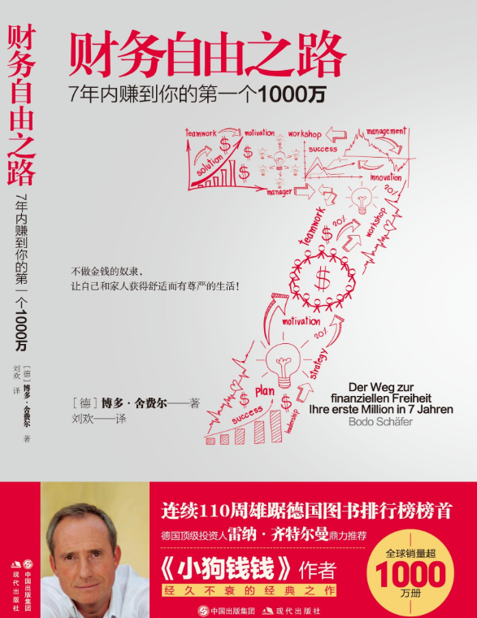

--------------------------------------

知乎读书

#### 第一章 你究竟想要什么

主要讲金钱的重要性，这个毋庸置疑啦，金钱太他吗重要了，我一天天不就为了那几百块钱吗

##### 五个方面：

健康  财务  关系  情感  人生意义

##### 一个思考

我的兴趣是什么，我究竟如何通过这个兴趣来赚钱

##### 一个价值观

要创造赚钱机器，不要终其一生的做一个赚钱机器

##### 四个方面

梦想   价值观  目标   策略