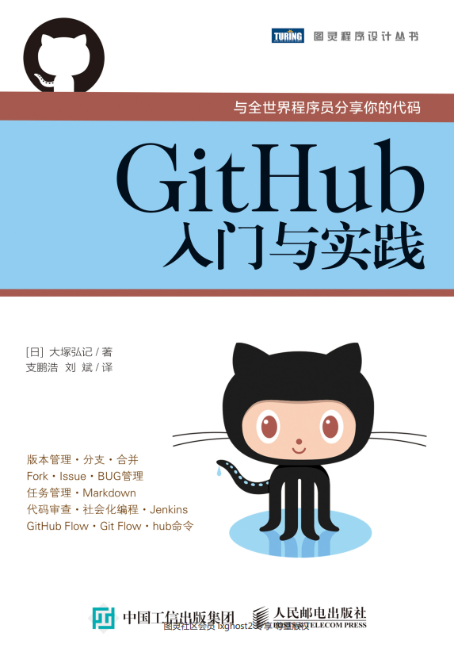

------------------------------------------------------------------

来自本地文件

### 第一章 来到GitHub的世界

介绍一下github大体功能，和他对程序员的工作带来的影响

简单介绍下一些常用的功能

Git与GitHub的区别:family_man_girl:github上的仓库都是通过git管理的。GitHub是一个服务，git是一套工具

社会化编程：代码就是一种文化，去走出去，看看世界，看看别人的代码是如何写的，这样更好的提高自己

### 第二章 git 的导入

Fork 就是将 GitHub 的某个特定仓库复制到自己的账户下。

这一章介绍了如何安装和初始化git

### 第三章 试用GitHub的前期准备

建立一个仓库的步骤

还是参考以前的资料吧：https://github.com/qi20172017/weibo_spider/blob/master/project.md

### 第四章 通过实际操作学习git

这里的 HEAD 是指向当前分支中最新一次提交的指针。

