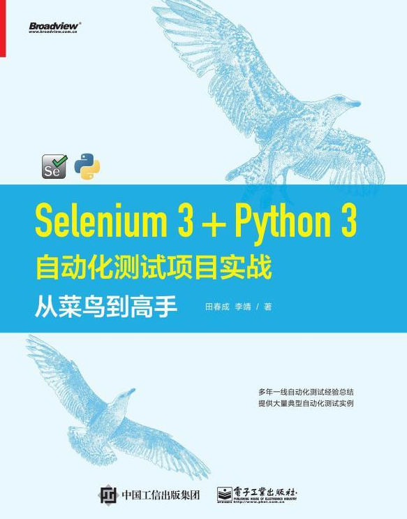

----------------------------------------------

来自知乎读书

## 第一篇 搭建环境

还没仔细看

## 第二篇 基础

### 4章 介绍前端

### 5章 元素定位

要测试，总之就是找到元素然后实现，点击、拖拽、输入操作

八大定位方式：

```python
driver.find_element_by_id()
driver.find_element_by_name()
driver.find_element_by_class()
driver.find_element_by_link_text()   #通过超链接
driver.find_element_by_partial_link_text()  #超链接的文字
driver.find_element_by_css()
driver.find_element_by_xpath()
driver.find_element_by_tag_name()
```

八大方式灵活运用，也不要老运用xpath，用个id,name有时候也很快捷

### 6章 常用方法

#### 基本方法

一些除了send_key()以外的其他方法，不过现在不知道应用场景

#### 特殊方法

##### 鼠标      这个很棒！

单击，双击，按住，拖拽，松开 ，

##### 按键

一些按键操作

##### 选择框

用到再说

##### 执行js

感觉这个肯定会有用，用js控制页面元素

可以同步执行，也可以异步执行，还可以用jQuery来写js代码

#### iFrame的切换

#### 上传文件

1 绕过去

2 竟然还有一种东西就像是Windows中的selenium

3 也是类似2的东西这个更厉害，可以直接用python调用

#### cookie

driver.get_cookies()方法

### 7章 高级用法？？

#### 滑块

有个方法可以输出元素的大小，这个也许有用

拖动话就用鼠标中提到的方法拖

#### 截图

提到截全屏图

##### 截元素

他说的是先截全屏，再用PIL切下来，其实有个直接选择了元素，就能接下来的方法

#### 验证码

除了第三方打码平台，他还提到用cookie

先手动等一次，拿到cookie，在用selenium拿着cookie去登

#### 页面切换

其实是有一个窗口句柄列表的，可以通过这个切换，想基本方法里也提到，有个方法可以获取当前的句柄，switch_to.window()方法执行换

#### 模糊定位

这个应该是算xpath语法中的东西，我爱用个的contains就是包含某些东西的元素，他又提到start-with  end-with方法。

#### 复合定位

用find_elements_by_xxx    注意这里是element*s*    有个s，找到的是一组

然后放到列表中，可以对单个元素操作了

